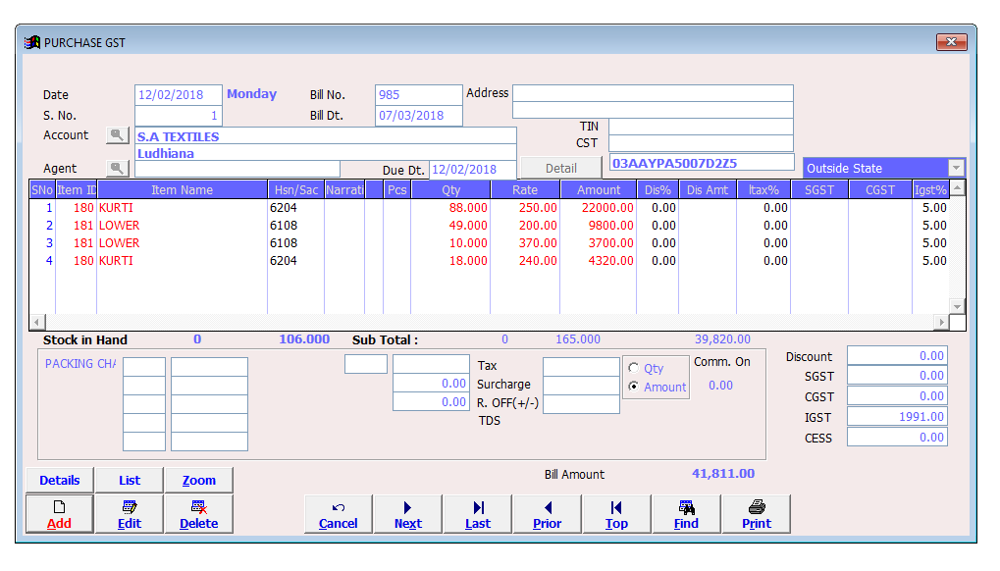

# Retrospective: How I would write this in 2025

⚠️ **Note to Reviewers:**
This Garments Barcode Application was built circa 2017 on PHP 5.6 with procedural scripts and jQuery-heavy pages. While the legacy logic still runs, it does not reflect my current engineering standards or what modern PHP 8.x tooling makes possible.

If I were rebuilding this today with PHP 8.3, I would modernize each outdated area like so:

- **Outdated:** Raw `mysqli` queries with interpolated strings inside pages such as `inventory.php` and `checkout.php`.
**Modern PHP 8.x fix:** Introduce Doctrine ORM or Laravel's Eloquent with typed models, parameter binding, and database migrations to eliminate SQL injection risk and improve maintainability.
- **Outdated:** Manual `require` chains and global functions spread across flat PHP files.
**Modern PHP 8.x fix:** Organize the codebase into namespaced modules with PSR-4 autoloading via Composer, leveraging services, controllers, and repositories.
- **Outdated:** No strict typing, no return types, and loosely-typed arrays being passed between views and business logic.
**Modern PHP 8.x fix:** Enable `declare(strict_types=1);`, use typed properties, enums for statuses, readonly DTOs, and expressive value objects to make invariants explicit.
- **Outdated:** Monolithic page scripts that mix HTML rendering, request validation, and data persistence in one file.
**Modern PHP 8.x fix:** Adopt a framework like Symfony or Laravel (or Slim + custom layers) with HTTP controllers, FormRequest-style validation, and dedicated service/repository layers for clean separation and testability.
- **Outdated:** Hard-coded configuration (DB paths, credentials) and ad-hoc session handling without CSRF protection.
**Modern PHP 8.x fix:** Load environment-specific settings from `.env` files via `symfony/dotenv`, use Laravel/Symfony CSRF middleware, and centralize auth/session logic behind typed guards.
- **Outdated:** No automated tests or CI, making regressions easy.
**Modern PHP 8.x fix:** Cover the domain with PHPUnit or Pest tests, add feature smoke tests for billing/inventory flows, and run them in GitHub Actions on every PR.

---

## Garments Barcode Application



### Overview
This repository contains a lightweight point-of-sale workflow tailored for garment retailers who print barcode stickers, maintain stock, and reconcile sales daily. The UI is powered by Bootstrap 3, jQuery, and Chart.js, while persistence is handled by a file-backed SQLite database (`data/safg.sqlite3`). PHP scripts inside the project root expose AJAX endpoints (`ajax-req-handler.php`) that serve inventory counts, sales summaries, and transaction logs to the dashboard in `index.php`.

### Core modules
- **Inventory & Product Master (`inventory.php`, `products.php`, `fetch-product.php`)** – manage SKU metadata, categories, and stock adjustments; print barcodes through the bundled `php-barcode-generator-master` utilities.
- **Checkout & Billing (`checkout.php`, `update_bill.php`)** – scan barcodes, build bills, compute totals/discounts, and persist completed invoices.
- **Sales Dashboard (`index.php`)** – visualize recent performance via Chart.js, filter sales by date range, and export/print reports.
- **Transaction Ledger (`transaction_rec.php`)** – capture non-sales cash movements (accrued/outstanding income) with mode-of-payment tagging.
- **Settings & Backups (`settings.php`, `backup.php`, `old_to_new_db.php`)** – migrate legacy databases, toggle UI behaviors, and snapshot the SQLite file for safekeeping.

## Feature highlights
- Fast barcode-driven checkout with auto-complete and quantity adjustments.
- Real-time stock depletion and low-inventory surfacing on the dashboard.
- Printable sales summaries and transaction receipts via `jQuery-Print`.
- Role-gated login/logout flow backed by PHP sessions.
- Lightweight reporting of accrued vs. outstanding income.
- Optional migration tooling to move from older schema versions into the current SQLite layout.

## Tech stack
- **Backend:** PHP 5.6+ (tested up to PHP 8.2) with SQLite3 extension.
- **Frontend:** Bootstrap 3, Font Awesome 4.7, jQuery 3.2.1, Chart.js 2.x, jquery-confirm, bootstrap-toggle.
- **Barcode:** [picqer/php-barcode-generator](php-barcode-generator-master/) for rendering printable labels.
- **Printing:** [jQuery.print](jQuery-Print/) for in-browser document exports.

## Repository layout
```
├── index.php # Analytics dashboard + quick transaction entry
├── checkout.php # Billing workflow driven by barcode scans
├── inventory.php # Stock table with inline edits and search
├── ajax-req-handler*.php # Central AJAX router for dashboard/widgets (SQLite & MySQL variants)
├── data/safg.sqlite3 # Primary SQLite database (do not commit sensitive data)
├── php-barcode-generator-master/ # Third-party barcode rendering library
├── jquery-confirm-master/, jQuery-Print/, bootstrap-toggle/ # Vendored UI plugins
├── images/, fonts/, style.css # Branding assets and custom theme tweaks
├── backup.php, old_to_new_db.php # Database migration and backup helpers
└── LICENSE
```

## Prerequisites
- PHP CLI/Web Server ≥ 7.4 with SQLite3, GD, and OpenSSL extensions enabled (original code targeted 5.6, but upgrading is recommended).
- Composer (only needed if you plan to update the barcode generator library).
- Modern browser with printing support (Chrome/Edge/Firefox).

## Quick start
1. **Clone the repository** and open it inside your preferred PHP-capable IDE.
2. **Provision the database:**
```bash
cp data/safg.sqlite3 data/safg.local.sqlite3
```
Update `database_connection.php` to point to the copied file so the original snapshot stays untouched.
3. **Serve the project:**
```bash
php -S localhost:8080 -t /path/to/garments-barcode-application-master
```
Alternatively, drop the folder inside Apache/Nginx `DocumentRoot` and ensure `AllowOverride All` is enabled for session handling.
4. **Log in** via `http://localhost:8080/login.php` using the credentials seeded in `database_connection.php` (default user/password placeholders are documented in the file comments).
5. **Load inventory data** under `inventory.php` or import historical stock using `old_to_new_db.php`.

## Configuration
- **Database location:** Edit `$database_name` inside `database_connection.php`. When running under PHP’s built-in server, absolute paths are safest.
- **Login credentials:** Stored in the SQLite `users` table; use `settings.php` or a SQLite browser to update hashed passwords.
- **Currency & labels:** Adjust UI strings and currency symbols in `header.php`, `style.css`, and the relevant PHP templates.
- **Barcode format:** `php-barcode-generator-master/index.php` illustrates how to tweak barcode size, DPI, and font. Generated assets are typically printed from `products.php`.

## Usage guide
### Manage catalog & inventory
1. Head to `products.php` to add or edit SKU metadata (names, prices, categories).
2. Open `inventory.php` to adjust on-hand quantities, flag damaged goods, or perform bulk updates via CSV.
3. Use the “Print Barcode” action beside each SKU to generate stickers before stocking shelves.

### Checkout & billing
1. Navigate to `checkout.php`.
2. Scan barcodes or search by SKU/code; the table updates totals automatically.
3. Apply discounts, confirm payment mode, and press **Generate Bill**.
4. The bill info is stored in SQLite and can be reprinted from `update_bill.php`.

### Sales analytics & reporting
- The landing `index.php` page streams daily sales into Chart.js; date pickers let you filter and print.
- Inventory and accrued-income widgets populate via AJAX every few seconds; use “show more/less” toggles for longer tables.
- `transaction_rec.php` lists all manual cash movements. Use the “Record Transaction” form on the dashboard to append new entries.

### Backups & migrations
- Run `backup.php` to download the current SQLite file.
- Use `old_to_new_db.php` when migrating from previous schema versions; it maps historical tables to the new layout.
- Consider adding a cron job that copies `data/safg.sqlite3` off-box nightly for disaster recovery.

## Testing & QA
- Core app code predates automated tests, but the bundled barcode library includes PHPUnit suites (`php-barcode-generator-master/tests`). Run them with `vendor/bin/phpunit` from that directory after installing dependencies.
- For the main application, smoke-test flows manually:
- Add/edit products.
- Complete a checkout from scan to bill print.
- Record a manual transaction and confirm it appears in `transaction_rec.php`.
- Verify dashboard widgets populate without PHP warnings in the logs (`log.txt`).

## Troubleshooting
- **Blank pages / headers already sent:** Ensure `short_open_tag` is enabled or replace any `<?` tags with `<?php`.
- **SQLite locking errors:** Verify only one process writes to `data/safg.sqlite3` at a time; remote sync tools can hold locks.
- **Barcode fonts missing:** Confirm GD extension is enabled and the `font` directory in `php-barcode-generator-master` is readable.
- **Session timeouts:** Adjust `session.gc_maxlifetime` and check browser cookie settings; login uses native PHP sessions.

## Roadmap / nice-to-haves
- Modularize AJAX handlers into discrete controllers with validation.
- Add role-based authorization so inventory edits and billing require elevated permissions.
- Introduce export pipelines (CSV/PDF) for sales history.
- Containerize the stack with Docker for predictable deployment.
